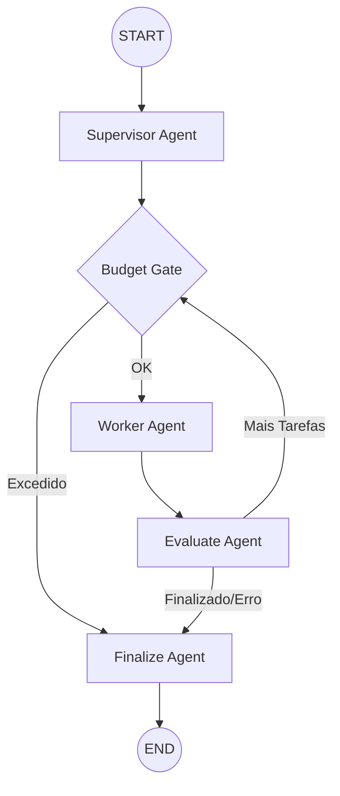

<div align="center">
  <h1>🌌 Aether</h1>
  <p><strong>Um Sistema Operacional Cognitivo baseado em Agentes Colaborativos</strong></p>
</div>

<br />

<div align="center">
  
  
  
  
  
  
  
  
</div>

<br />

---

## 📖 Sobre o Projeto

**Aether** é um sistema de Inteligência Artificial avançado, desenhado para lidar com objetivos complexos por meio de um orquestrador de múltiplos agentes colaborativos. Ao definir uma meta de alto nível, o Aether instancia uma rede de agentes autônomos que cooperam entre si, planejando, executando, avaliando e consolidando tarefas de forma inteligente e segura.

Diferente de um chatbot tradicional, o Aether atua como um "sistema operacional de IA": executa fluxos em background, possui comunicação via streaming bidirecional em tempo real, validações de segurança em repouso e em trânsito, integração com um servidor MCP nativo e uma interface web altamente interativa e otimista.

---

## ✨ Recursos Principais

### 🧠 Orquestração Multi-Agente (LangGraph)

Gerenciamento rígido do fluxo e transições de estado através do **LangGraph**, definindo uma máquina de estados robusta composta pelos seguintes nós:

- **Supervisor**: Recebe a meta do usuário, cria o planejamento e decompõe em sub-tarefas.
- **Budget Gate**: Valida o consumo cumulativo de tokens antes de despachar cada tarefa para o Worker.
- **Worker**: Executa a tarefa atual fazendo chamadas automáticas às Skills apropriadas.
- **Evaluate**: Analisa o resultado obtido pelo Worker contra os critérios de aceitação.
- **Finalize**: Consolida o resultado final da execução, gera o sumário e salva a memória cognitiva.



### ⚡ Streaming em Tempo Real (SSE)

Acompanhamento detalhado do processo cognitivo (_Think-Act-Observe-Decide_) de cada agente em tempo real por meio de _Server-Sent Events_ (SSE). O frontend exibe atualizações reativas instantâneas de logs de pensamento, execuções de skills e progresso de tokens.

### 🔌 Servidor Model Context Protocol (MCP)

Integração nativa com o protocolo **Model Context Protocol** via **FastMCP** (rodando em `/mcp` sob validação do header `X-MCP-Api-Key`). Permite que clientes de IA externos (ex: Claude Desktop) acessem as ferramentas e habilidades sem estado do Aether com total compatibilidade.

### 🛠️ Skill System com Autodiscover

As ferramentas que os agentes equipam são construídas sob os princípios SOLID como classes injetáveis que herdam de uma classe base comum. O backend conta com um mecanismo de **Autodiscover** no `SkillRegistry` que escaneia o diretório de skills dinamicamente.

- 🌐 `WebSearch`: Pesquisas web aprofundadas usando a API do Tavily.
- 💻 `CodeInterpreter`: Execução isolada e segura de códigos Python em sandboxes através da E2B API.
- 📁 `FileWriter`: Persistência de arquivos e relatórios com upload automático para buckets do Supabase Storage.
- ⏳ `TimeManager`: Resoluções e cálculos temporais precisos via biblioteca Pendulum.
- 🧠 `MemoryRecall`: Consulta semântica à memória cognitiva de execuções passadas do usuário.

### 💾 Memória Cognitiva Semântica (pgvector)

Uso de banco de dados vetorial **pgvector** integrado ao Supabase. Ao final de cada execução bem-sucedida, memórias relevantes do run são vetorizadas usando embeddings do Gemini e inseridas na tabela `memories`. Durante novas execuções, o agente pode evocar memórias passadas via busca por similaridade de cosseno (RPC `match_memories`), acelerando a resolução de tarefas parecidas.

### ⏸️ Human-in-the-Loop (HITL)

Pausa na execução em tempo de execução para solicitar aprovação explícita do usuário antes de executar skills críticas (como alterar arquivos sensíveis). Gerenciado de forma assíncrona por meio de `asyncio.Event` no backend e um painel interativo de aprovação rápida (`HitlPanel`) no frontend.

### 🔒 Segurança, Rate Limiting & Criptografia

- **Criptografia Simétrica (AES-128 Fernet)**: API keys de LLMs de usuários são salvas criptografadas no banco (`user_settings`) usando a chave `SETTINGS_ENCRYPTION_KEY`.
- **Guardrails de Injeção**: Validação de inputs de texto com regex contra padrões de prompt injection.
- **Budget Controller**: Monitora o consumo acumulado de tokens em tempo real, interrompendo a run se ultrapassar o orçamento predefinido.
- **Rate Limiting**: Proteção das rotas do FastAPI usando `slowapi`.
- **RLS (Row Level Security)**: Todas as tabelas no Supabase possuem políticas ativas para isolar completamente os dados de cada usuário.

### 🎨 Premium Modern UI

Interface responsiva inspirada em Bento Grid e design escuro premium:

- **Visualizador de Grafo Reativo**: Grafo interativo construído com `@xyflow/react` (React Flow v12) mostrando visualmente qual nó do grafo de agentes está ativo.
- **Interface Next.js 16 & React 19**: App Router, hooks de streaming reativos e componentes robustos.
- **Feedback Visual**: Transições suaves e notificações Toast rápidas com `sonner` e animações do `framer-motion`.

---

## 🏗️ Estrutura do Repositório

O projeto é organizado como um monorepo usando `pnpm workspaces`:

```
aether/
├── apps/
│   ├── web/               # Next.js 16 Frontend (React 19, Tailwind CSS v4, xyflow)
│   │   ├── app/           # Rotas do Next.js (Dashboard, Run, Settings, Admin, History)
│   │   ├── components/    # Componentes de interface (Bento, Chat, Graph, HITL, UI)
│   │   └── hooks/         # Hooks para streaming de eventos SSE
│   └── server/            # FastAPI Python Backend
│       ├── agents/        # Máquina de estados do LangGraph (Supervisor, Worker, Nodes)
│       ├── api/           # Rotas da API, middleware de Rate Limit, CORS e MCP
│       ├── core/          # Módulos centrais (Budget, Crypto Fernet, Memory, Security)
│       └── skills/        # Catálogo de Skills autodescobertas
├── supabase/              # Configurações locais do Supabase e migrations
│   └── migrations/        # Migrações SQL (tabelas, triggers, RLS, grants)
├── docker-compose.yml     # Orquestração local para desenvolvimento em container
└── package.json           # Scripts de build, execução e testes do monorepo
```

---

## 🚀 Como Começar

### Pré-requisitos

- [Node.js](https://nodejs.org/en/) >= 20
- [pnpm](https://pnpm.io/) >= 8
- [Python](https://www.python.org/) >= 3.10
- [Supabase CLI](https://supabase.com/docs/guides/local-development) (caso vá rodar o banco localmente)

### 1. Clonar o Repositório e Configurar Envs

```bash
git clone https://github.com/YgorStefan/aether.git
cd aether
cp .env.example .env
```

> [!IMPORTANT]
> Certifique-se de configurar as chaves necessárias no `.env` (ex: `GEMINI_API_KEY`, `SUPABASE_SERVICE_KEY`, etc.). Para testar criptografia de credenciais, gere uma chave de criptografia Fernet e defina em `SETTINGS_ENCRYPTION_KEY`:
>
> ```bash
> python -m cryptography.fernet
> ```

### 2. Configurar o Supabase e Banco de Dados

Se você estiver usando o Supabase CLI para desenvolvimento local, inicie-o na raiz:

```bash
supabase start
```

Após aplicar as migrações, certifique-se de executar o arquivo SQL da função de busca de memórias ([001_match_memories.sql](file:///c:/Users/Ygor/aether/apps/server/migrations/001_match_memories.sql)) no banco. As migrações do Supabase em `supabase/migrations/` incluem a configuração automática de RLS, triggers de perfil e os `grants.sql` fundamentais para a comunicação com o PostgREST no ambiente local.

### 3. Instalar Dependências do Monorepo

Na raiz do monorepo:

```bash
pnpm install
```

Para o backend (Python):

```bash
cd apps/server
python -m venv venv
# Ativação do venv no Windows:
.\venv\Scripts\activate
# Ativação no Linux/macOS:
source venv/bin/activate

pip install -r requirements.txt
```

### 4. Executar o Projeto Localmente

Na raiz do projeto, você pode subir o backend e o frontend concorrentemente rodando:

```bash
pnpm run dev
```

- **Frontend**: `http://localhost:3000`
- **Backend API Docs**: `http://localhost:8000/docs`
- **Servidor MCP**: `http://localhost:8000/mcp` (Requer header `X-MCP-Api-Key`)

---

## 🧪 Suíte de Testes

O projeto conta com testes automatizados e de carga em ambas as frentes:

### Frontend (`apps/web`)

- **Testes Unitários e de Componentes**: Usando `vitest` e `@testing-library/react`.
  ```bash
  pnpm --filter web test
  ```
- **Testes de Integração e E2E**: Configurados via `playwright`.
  ```bash
  pnpm --filter web test:e2e
  ```

### Backend (`apps/server`)

- **Testes Unitários e Integração**: Utilizando `pytest`.
  ```bash
  pytest
  ```
- **Testes de Carga**: Escritos com **Locust** ([locustfile.py](file:///c:/Users/Ygor/aether/apps/server/tests/load/locustfile.py)) para medir latência e throughput dos endpoints.
  ```bash
  cd apps/server
  locust -f tests/load/locustfile.py
  ```

---

## 👨‍💻 Contribuição

Para contribuir:

1. Faça um _fork_ do repositório.
2. Crie uma branch com a funcionalidade (`git checkout -b feature/nova-skill`).
3. Faça _commit_ das suas alterações (`git commit -m 'feat: add memory skill'`).
4. Envie a branch (`git push origin feature/nova-skill`).
5. Abra um _Pull Request_.

## 📄 Licença

Este projeto é desenvolvido para estudos avançados em Inteligência Artificial Agentica e uso público.

---

<div align="center">
  <p>Desenvolvido com ❤️ por Ygor Stefankowski da Silva. 🚀</p>
</div>
